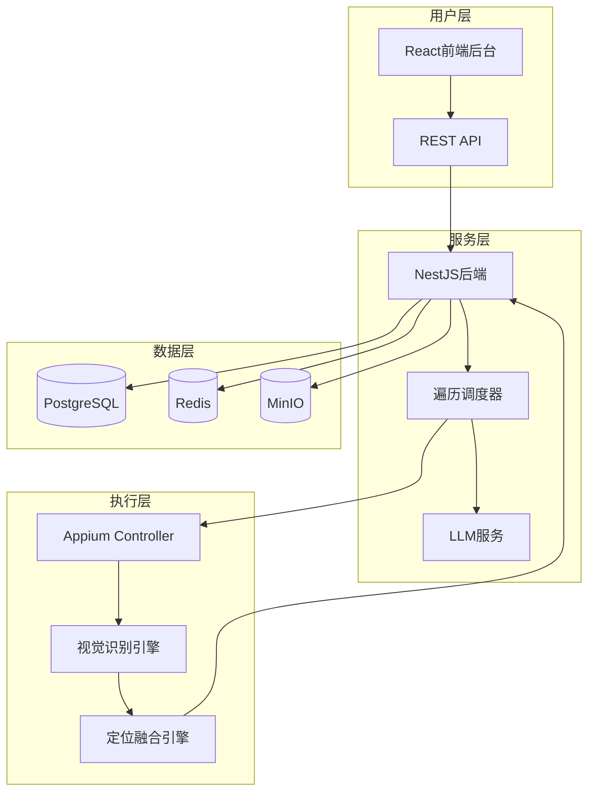

# LLM 驱动的手机端 UI 自动化定位系统 - Maestro

基于 Qwen3-VL 多模态模型和 MidSceneJS 视觉引擎的 Android UI 自动化定位系统。

## 项目概述

Maestro 通过 LLM 驱动的智能遍历和视觉识别技术，自动化生成 Android 应用的 UI 元素定位策略，降低自动化脚本的维护成本。

### 核心特性

- ✅ **智能遍历**: LLM 驱动的自动化界面遍历，支持复杂业务流程
- 🎯 **视觉定位**: 结合 DOM 和视觉特征的混合定位策略
- 🔄 **自动验证**: 定位策略自动验证与置信度评分
- 📊 **界面版本库**: 跨版本界面差异分析与告警
- 🚨 **智能告警**: 多渠道告警通知（飞书/企业微信/邮件）
- 📈 **可视化后台**: 完整的任务管理和数据分析平台

## 技术架构

### 技术栈

| 层级 | 技术 |
|------|------|
| 前端 | React 18 + TypeScript + TailwindCSS + shadcn/ui |
| 后端 | NestJS + TypeScript + Prisma ORM |
| 数据库 | PostgreSQL 16 |
| 缓存 | Redis 7 |
| 存储 | MinIO |
| 自动化 | Appium 2.x + WebDriverIO |
| 视觉 | MidSceneJS + Qwen3-VL |
| 部署 | Docker + Docker Compose |

### 系统架构



## 快速开始

### 前置要求

- Node.js 20+
- pnpm 8+
- Docker & Docker Compose
- Android SDK (含 ADB)

### 1. 克隆项目

```bash
git clone <repository-url>
cd maestro
```

### 2. 启动基础服务

```bash
cd docker
docker-compose up -d postgres redis minio
```

### 3. 配置后端

```bash
cd backend
cp .env.example .env
# 编辑 .env 配置数据库连接

pnpm install
pnpm prisma:migrate
pnpm start:dev
```

后端服务: http://localhost:3000
API文档: http://localhost:3000/api/docs

### 4. 运行PoC验证

#### Appium验证

```bash
# 启动Appium Server
appium

# 在新终端运行测试
cd poc/appium-test
pnpm install
pnpm test
```

#### MidSceneJS验证

```bash
cd poc/midscene-test
pnpm install
pnpm test
```

## 项目结构

```
maestro/
├── backend/                 # NestJS后端服务
│   ├── src/
│   │   ├── modules/
│   │   │   ├── devices/    # 设备管理模块
│   │   │   ├── apps/       # 应用版本管理模块
│   │   │   └── common/     # 公共模块
│   │   ├── prisma/         # 数据库Schema
│   │   └── main.ts
│   ├── test/               # 测试文件
│   └── package.json
├── poc/                    # PoC验证脚本
│   ├── appium-test/       # Appium环境验证
│   └── midscene-test/     # MidSceneJS集成验证
├── docker/                # Docker配置
│   ├── docker-compose.yml
│   └── backend.Dockerfile
├── docs/                  # 文档
├── .github/              # CI/CD配置
└── README.md
```

## 迭代开发

### Iteration 0 ✅ (已完成)

- [x] NestJS后端项目初始化
- [x] Prisma数据库Schema设计
- [x] 设备管理模块（含ADB验证）
- [x] 应用版本管理模块
- [x] 统一异常处理和API响应格式
- [x] Appium PoC验证
- [x] MidSceneJS PoC验证
- [x] Docker开发环境
- [x] CI流水线配置
- [x] 单元测试和集成测试

### Iteration 1 (进行中)

见 `docs/迭代开发指南.md` 了解详细任务清单。

## 核心功能

### 1. 设备管理

- 设备注册与状态监控
- ADB自动验证与心跳检测
- 多设备并发支持

### 2. 应用版本管理

- 应用和版本信息管理
- 版本变更追踪
- APK哈希校验

### 3. 遍历任务调度（Iteration 1）

- 基于状态机的智能遍历
- LLM驱动的动作生成
- 自动回退与错误恢复

### 4. 定位生成与验证（Iteration 2）

- DOM + 视觉特征融合
- 多策略定位候选
- 自动验证与置信度评分

### 5. 界面版本库与差异分析（Iteration 3）

- 界面签名生成
- 跨版本差异检测
- 变更告警

## 开发

### 代码规范

项目遵循严格的代码规范：
- TypeScript严格模式
- ESLint + Prettier
- 单一职责原则
- 完整的注释和文档

详见 `.cursor/rules/` 目录下的规范文件：
- `coding-standards.mdc` - 通用代码规范
- `backend-api-standards.mdc` - 后端API规范
- `database-standards.mdc` - 数据库规范
- `frontend-guidelines.mdc` - 前端规范
- `version-control-standards.mdc` - 版本管理规范

### 提交规范

```bash
feat(module): 新功能
fix(module): 修复问题
docs: 文档更新
test: 测试相关
refactor: 代码重构
perf: 性能优化
```

### 测试

```bash
# 后端单元测试
cd backend
pnpm test

# 覆盖率报告
pnpm test:cov

# E2E测试
pnpm test:e2e
```

目标覆盖率：
- Iteration 1: ≥40%
- Iteration 3: ≥60%
- 上线前: ≥70%

## 文档

| 文档 | 说明 |
|------|------|
| [PRD需求.md](PRD需求.md) | 产品需求说明书 |
| [数据库设计.md](数据库设计.md) | 数据库Schema设计 |
| [界面设计.md](界面设计.md) | 前端界面设计 |
| [原型设计.md](原型设计.md) | 产品原型设计 |
| [迭代开发指南.md](迭代开发指南.md) | 迭代开发计划 |
| [backend/README.md](backend/README.md) | 后端开发文档 |
| [docker/README.md](docker/README.md) | Docker部署文档 |

## 部署

### 开发环境

```bash
cd docker
docker-compose up -d
```

访问：
- Backend: http://localhost:3000
- MinIO: http://localhost:9001
- PostgreSQL: localhost:5432

### 生产环境

见 `docker/README.md` 的生产部署章节。

## 监控与日志

### 健康检查

```bash
curl http://localhost:3000/api/v1/health
```

### 日志查看

```bash
# 查看后端日志
docker-compose logs -f backend

# 查看数据库日志
docker-compose logs -f postgres
```

### 指标监控（Iteration 5）

- Prometheus + Grafana
- 关键指标：QPS、延迟、错误率、覆盖率

## 贡献指南

1. Fork项目
2. 创建特性分支 (`git checkout -b feature/AmazingFeature`)
3. 提交变更 (`git commit -m 'feat: Add AmazingFeature'`)
4. 推送到分支 (`git push origin feature/AmazingFeature`)
5. 提交Pull Request

## 许可证

MIT License

## 联系方式

- 项目仓库: [GitHub链接]
- 问题反馈: [Issues]

---

**当前状态**: Iteration 0 已完成 ✅

**下一步**: 开始 Iteration 1 - 遍历指挥调度核心

见 `docs/迭代开发指南.md` 了解详细任务。

## 任务列表

- [x] T01 梳理首批试点应用与关键业务流程（完成于本次会话）
- [x] T02 Traversal Orchestrator 详细设计
- [x] T03 LLM Prompt 模板与安全策略
- [x] T04 定位生成算法技术方案
- [x] T05 MidSceneJS 集成与封装方案
- [x] T06 数据模型与存储结构设计
- [x] T07 对外 API 与消息队列契约定义
- [x] T08 可视化后台原型设计
- [x] T09 运维监控与告警方案
- [x] T10 测试策略与验收标准落地计划
- [x] F01 框架使用细节深化（Appium/ADB、MidSceneJS、NestJS、React）
- [x] F02 数据库设计文档（数据库设计.md）
- [x] F03 界面设计说明（界面设计.md）
- [x] F04 原型设计说明（原型设计.md）
- [x] F05 迭代开发指南（迭代开发指南.md）
- [x] F06 项目规则（rules/*）
- [x] T11 GPT-5 模型选型建议（完成于本次会话）
- [x] **Iteration 0 完整实现** ✅
  - [x] NestJS后端项目初始化
  - [x] Prisma ORM配置和Schema设计
  - [x] 设备管理模块（DevicesModule）
  - [x] 应用版本管理模块（AppsModule）
  - [x] 统一异常处理和API响应格式
  - [x] Appium PoC验证脚本
  - [x] MidSceneJS PoC验证脚本
  - [x] Docker开发环境配置
  - [x] CI/CD流水线设置
  - [x] 单元测试和集成测试
