## 后续原子任务清单

| 编号 | 原子任务 | 目标产出 | 建议提示词 |
| --- | --- | --- | --- |
| T01 | 梳理首批试点应用与关键业务流程 | 明确个人常用的 1~2 条遍历路径及账号/环境约束 | 请根据《LLM 驱动的手机端 UI 自动化定位系统》需求文档，列出本人在公司内最常用的测试流程与应用，并补充必要的账号、环境、依赖条件清单。 |
| T02 | 编写 Traversal Orchestrator 详细设计 | 构建状态机、遍历策略、异常恢复策略的设计说明 | 请基于需求文档第 6.1、10 章，输出 Traversal Orchestrator 设计方案（包含状态机、动作队列、去重策略、回退机制、失败重试流程）。 |
| T03 | 设计 LLM Prompt 模板与安全策略 | 提供标准化 Prompt、系统提示、安全白名单及日志策略 | 请围绕第 6.2 章内容，针对 Qwen3 多模态模型撰写调度 Prompt 模板、安全约束、调用日志规范及异常输出处理流程。 |
| T04 | 定位生成算法技术方案 | 定义 DOM/视觉特征融合、置信度计算、动态属性过滤逻辑 | 请结合第 6.3 章，详细说明定位生成算法，包括特征提取、候选策略、动态属性识别、置信度评分与自动验证步骤。 |
| T05 | MidSceneJS 集成与封装方案 | 确认运行环境、性能需求、接口封装（含容器化方案） | 请依据需求文档中 MidSceneJS 相关要求，给出集成步骤、依赖配置、性能评估方案和容器化/部署建议。 |
| T06 | 数据模型与存储结构设计 | 完整的 ER 图、表结构、索引策略与数据留存周期 | 请根据第 8 章，输出 Screens、Elements、Actions、LLMLogs、Alerts 的表结构、字段设计、索引及数据留存策略。 |
| T07 | 对外 API 与消息队列契约定义 | REST/WebSocket 接口规范、参数校验、队列消息格式 | 请依据第 9 章，结合 TypeScript + NestJS + OpenAPI/JSON Schema 的实现方式，编写 API 契约（路径、方法、入参、响应示例、错误码）及消息队列主题、消息体示例。 |
| T08 | 可视化后台原型设计 | 线框/原型、页面信息架构、关键互动流程 | 请围绕第 6.5、5 章描述，为基于 TypeScript + React + TailwindCSS + shadcn/ui 的可视化后台绘制信息架构和关键页面原型，并标注交互说明（聚焦个人使用的必备页面）。 |
| T09 | 运维监控与告警方案 | 指标体系、日志采集、告警阈值、恢复手册 | 请结合第 12、15 章，编写运维监控指标、告警策略、自动恢复流程与人工操作手册。 |
| T10 | 测试策略与验收标准落地计划 | 测试用例矩阵、执行计划、验收标准与度量指标 | 请参考第 13、17 章，制定测试用例矩阵、时间安排、资源需求及验收指标（面向个人常规回归场景）。 |

> 所有提示词可在调用 Qwen3 多模态模型时作为系统/用户输入模板使用，执行前请补充具体上下文与最新需求变更。

### T01 首批试点应用与流程梳理

| 应用 | 核心流程 | 测试目标 | 账号与权限 | 设备 / 环境 | 依赖条件 | 风险与注意事项 |
| --- | --- | --- | --- | --- | --- | --- |
| 企业审批中心 APP | 差旅报销单创建 → 单据校验 → 主管审核 → 财务稽核 | 验证差旅报销端到端稳定性，确保动态表单字段定位稳定 | QA 专用账号 `qa.approval@corp`（含差旅、财务稽核角色）；主管审核使用 `leader.approval@corp`；财务复核需 `finance.audit@corp` | Android 13 真机 Pixel 6（公司 MDM + VPN）、Android 12 模拟器对比验证；App 版本 6.3.1 | Appium Server 2.1.0、Appium UiAutomator2 Driver 2.32、ADB 35.0.2、MidSceneJS 1.4.0（需 CUDA 11.8）、Postgres 测试库 `maestro_uat`、MinIO QA 桶 `ui-auto-screenshots` | 报销单需使用真实票据影像，禁止模拟凭证；VPN 心跳需常驻，断连自动恢复；财务节点对定位可靠性要求高，需多次重放验证 |
| 客户工单助手 APP | 工单拉取 → 详情巡检 → 转派与备注 → 完成回执 | 覆盖高频客户支持路径，校验列表懒加载、推送、角色差异界面 | QA 账号 `qa.ticket@corp`（客服 + 质检权限）；协同账号 `ops.ticket@corp` 用于转派、关闭；推送验证需运营账号 `ops.notice@corp` | Android 14 真机 Galaxy S23（Wi-Fi ≥20Mbps）、Android 12 模拟器；App 版本 4.8.0；需企业网关与通知服务可达 | Appium Server 2.1.0、Appium Espresso Driver 1.68、ADB 35.0.2、MidSceneJS 1.4.0、消息队列测试实例 `mq-uapp-uat`、Elasticsearch 观测集群 `es-support-uat` | 工单含敏感客户信息，日志需脱敏；模拟器缺少推送能力，通知场景依赖真机；需预置 20 条真实测试工单数据以保证覆盖 |

#### 企业审批中心 APP – 差旅报销流程

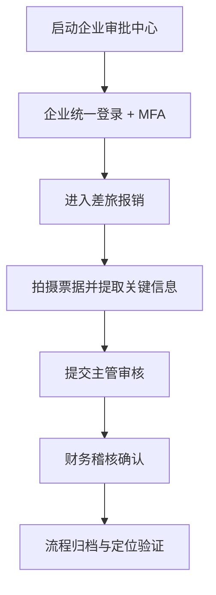

#### 客户工单助手 APP – 工单闭环流程

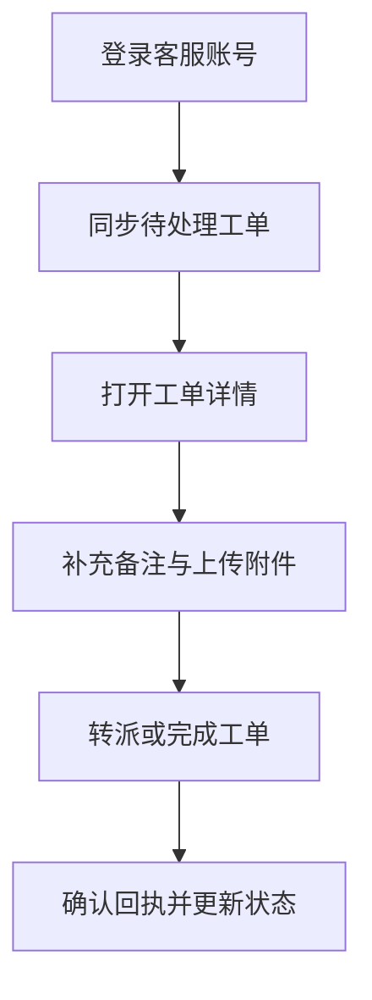

### T02 Traversal Orchestrator 详细设计

#### 状态机分层

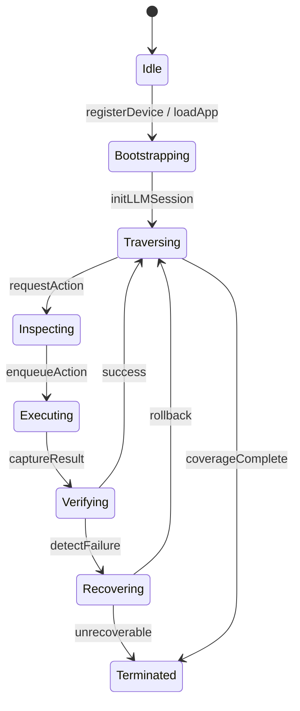

- `Idle`：等待调度指令，校验任务白名单与设备健康状况。
- `Bootstrapping`：同步 APP 版本、清空缓存、拉取动作白名单及LLM Prompt 模板。
- `Traversing`：默认主循环，维护界面访问图与深度限制。
- `Inspecting`：向 LLM 请求下一动作前收集上下文（截图、DOM、历史操作）。
- `Executing`：指令落地，调用 Appium/ADB 执行，记录耗时与返回码。
- `Verifying`：自动校验界面签名及定位有效性，更新置信度。
- `Recovering`：异常处理阶段，包含动作回退、APP 重启、状态机回溯。
- `Terminated`：遍历结束或出现不可恢复故障，生成告警。

#### 动作队列与优先级

- 使用多级队列：`primaryQueue`（LLM 建议动作）、`fallbackQueue`（预置关键路径）、`revisitQueue`（低置信界面复检）。
- 每个动作包含界面签名、预期影响、最大重试次数、依赖前置动作。
- 引入 `LLMConfidence`、`HistoricalSuccessRate`、`BusinessPriority` 三维评分，决定队列出队顺序。
- 队列采用 Redis Stream 或消息队列以便后续扩展多设备并行，当前部署使用本地优先队列实现。

#### 去重策略

- 维护 `VisitedGraph`，节点为界面签名，边为动作触发的状态转换。
- 对即将出队的动作计算 `(targetSignature, actionType, parametersHash)` 哈希，命中则放弃或降级到 `revisitQueue`。
- 提供深度与广度限制：同一分支深度超过阈值时仅保留关键节点；同一界面多次访问超过阈值时触发人工复核标记。

#### 回退机制

- 执行失败后优先尝试 `UI Undo` 动作（返回、关闭弹窗）；若失败次数达阈值，执行 `App Restart` 并恢复至最近成功界面。
- 记录回退链路，超过设定次数推送告警并暂停当前流程。
- 对出现崩溃的界面，标记 `blocked` 状态，等待人工处理或后续迭代。

#### 失败重试流程

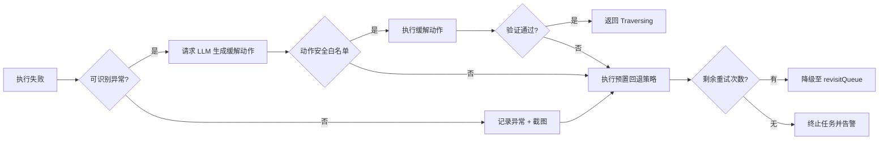

#### 关键指标

- 动作平均耗时、LLM 决策延迟、成功率、回退次数、界面覆盖率、未复核节点数。
- 所有指标写入 Prometheus，并与告警模块联动。

#### Appium / ADB 执行细则

- 驱动配置：
  - Android 真机：`automationName=UiAutomator2`、`appium:uiautomator2ServerInstallTimeout=120000`、`appium:adbExecTimeout=60000`、`appium:newCommandTimeout=180`。
  - 模拟器：追加 `avdLaunchTimeout`、`dontStopAppOnReset=true`、`unicodeKeyboard=true`、`resetKeyboard=true`，确保回放可输入多语言。
- 会话管理：
  - 使用 Appium Service 对象池，按设备维度缓存 `sessionId`，避免频繁重连；异常时通过 `adb shell am force-stop` 清理残留进程。
  - 针对多设备并发，引入 `@wdio/appium-service` 的 driver wrapper，结合 Redis 分布式锁保证单设备单会话。
- ADB 监控：
  - 周期性执行 `adb shell dumpsys window windows` 校验顶层 Activity；
  - 捕获 `logcat` 关键字（ANR、E/AndroidRuntime）并写入 Actions 表；
  - 网络诊断通过 `adb shell ping` 与 `adb shell dumpsys connectivity` 报告网络状态，异常时触发回退。

### T03 LLM Prompt 模板与安全策略

#### Prompt 结构

- `system`：固化角色、目标、约束（禁止越权动作、要求输出 JSON）。
- `user`：提供当前界面上下文（截图摘要、DOM 关键节点、历史操作）。
- `context`：附加外部知识（动作白名单、业务优先级、失败样例）。
- `tool_hooks`：声明 `_list_actions`、`_navigate`、`_inspect_dom`、`_capture_screen` 的参数契约。

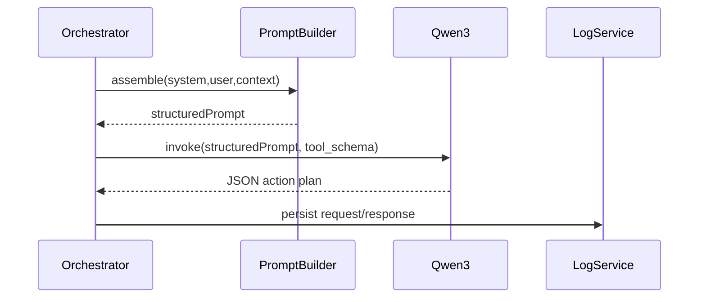

#### 安全约束

- 动作白名单：仅允许注册在 `actions_whitelist` 表中的指令；包含参数范围校验。
- 参数合法性：正则过滤动态文本，屏蔽密码、个人信息；限定点击坐标在可见区域。
- 速率限制：对同一界面连续调用限制为 1 次/秒；每日总 token 使用量须低于预算阈值。
- 审计追踪：记录完整思维链、输入输出、工具调用顺序，写入 `LLMLogs`。

#### 异常处理

- 解析失败：触发 `_list_actions` 回退，使用默认动作集合；同时打点告警。
- 安全策略命中：直接拒绝执行，并返回结构化错误 `{code:"POLICY_BLOCKED"}`。
- LLM 超时：回退至上一界面，重试不超过 2 次，之后切换预置遍历策略。

#### Prompt 示例骨架

- `system` 关键段：
  - 职责：仅输出 JSON；不得执行非白名单动作。
  - 风险控制：检测危险指令时返回 `abort`。
- `user` 数据字段：`screen_signature`、`screen_summary`、`dom_focus_nodes`、`action_history`、`alerts`。
- `assistant` 预期输出：`{"action":"navigate","params":{...},"confidence":0.82,"rationale":"..."}`。

#### 日志与脱敏

- 所有请求响应存入 MinIO + Postgres，保留 180 天。
- 对包含账号、客户信息字段进行哈希或掩码；截图添加水印及访问审计记录。

### T04 定位生成算法技术方案

#### 特征提取

- DOM：采集 `resourceId`、`contentDesc`、`text`、`className`、层级路径、可见性、可点击属性。
- 视觉：MidSceneJS 输出的 bounding box、OCR 文本、视觉 embedding、颜色/形状特征。
- 行为：历史点击成功率、同类控件平均置信度。

#### 候选策略

- 组合定位：优先 `resourceId + text`，其次 `contentDesc + className`，最后 `visualTemplate`。
- 同步生成 XPath 但仅作兜底；记录生成原因和预期稳定性标签。
- 基于屏幕区域密度进行排名，避免重叠区域重复尝试。

#### 动态属性识别

- 通过正则与统计检测疑似动态字段（时间、UUID、hash）。
- 比对历史版本属性，若差异超过阈值，则降权或剔除该定位。
- 对 OCR 文本进行模糊匹配，容忍轻微变化（如金额精度）。

#### 置信度计算

- 公式：`score = Σ (wi * fi)`，其中 `fi` 包含来源可靠性、可见性、交互验证、历史稳定性。
- 权重初始取值：`resourceId=0.3`、`text=0.2`、`contentDesc=0.15`、`visualMatch=0.2`、`history=0.1`、`context=0.05`，可通过离线回测调整。
- 置信度低于 0.5 触发 `revisitQueue`；0.7 以上标记为首选策略。

#### 自动验证

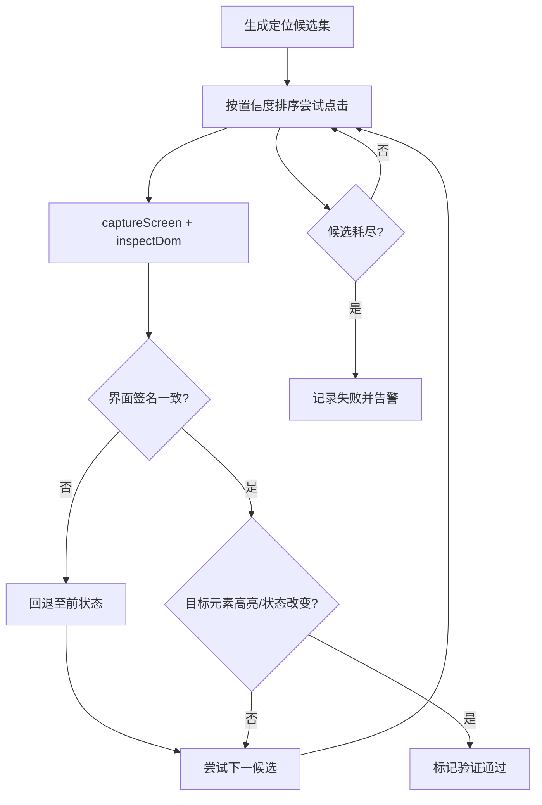

#### 数据沉淀

- 记录定位与界面签名的对应关系，包含置信度、验证状态、截图。
- 失败样本进入训练集，用于离线提升置信度模型。
- 通过 diff 引擎检测同一界面不同版本的定位变化，生成报告。

### T05 MidSceneJS 集成与封装方案

#### 运行环境

- 目标 GPU：NVIDIA T4，CUDA 11.8，TensorRT 可选。
- 容器基础镜像：`nvidia/cuda:11.8.0-cudnn8-runtime-ubuntu22.04`。
- Node.js 20 LTS、Python 3.11（供 MidSceneJS Python 绑定）、ffmpeg 6.0。
- 需要开启 `--gpus all`，并配置 `NVIDIA_DRIVER_CAPABILITIES=all`。

#### 集成步骤

1. 安装 MidSceneJS CLI 与核心包：`npm install -g midscenejs-cli`、`npm install midscenejs`。
2. 在 Appium 执行节点部署 MidSceneJS 服务，以 gRPC/HTTP 提供接口。
3. 将截图、视频流通过共享内存或 MinIO 传递给 MidSceneJS，返回元素坐标与 OCR。
4. 引入缓存层（Redis），对重复界面使用历史视觉结果，减少 GPU 占用。

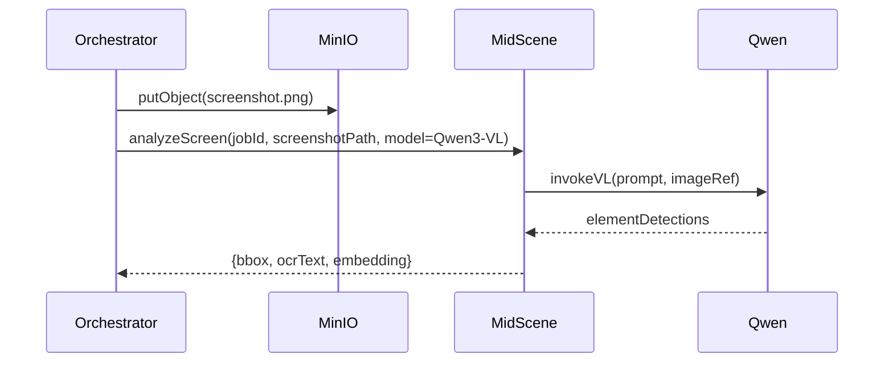

#### 封装策略

- 提供 `MidSceneAdapter`，统一方法：`analyzeScreen`, `extractVisualFeatures`, `matchElement`。
- 支持同步与异步模式：遍历主线程采用异步等待，避免阻塞。
- 对异常情况（GPU 不可用、超时）降级至 OCR-only 模式，并记录性能指标。

#### 配置管理

- 全局配置文件 `midscene.config.ts`：
  - `provider: "qwen3-vl"`、`resolution: 1080x1920`、`maxDetections: 40`。
  - GPU 资源标签：`deviceId`、`cudaVisibleDevices`，用于多 GPU 调度。
- 环境变量：
  - `MIDSCENE_API_TOKEN`、`QWEN_API_BASE`、`QWEN_API_KEY`；通过 Vault/Secrets Manager 注入。
  - `CACHE_TTL_SECONDS` 控制 Redis 缓存时长。
- 记录配置版本，与 `Screens` 表的 `captured_at` 绑定，便于复现模型输出。

#### 性能基线

- 单帧分析目标：< 500 ms；批处理 10 帧 < 4 s。
- GPU 利用率保持在 60% 以下，超阈值触发缩减遍历策略。
- 定期运行基准测试（每周）并输出报告。

#### 容器化部署

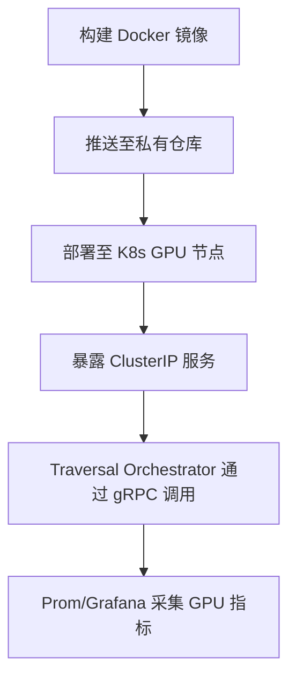

- 使用 Helm Chart 管理配置，支持多实例伸缩。
- 健康检查：`/healthz` 返回 GPU 状态、队列深度。
- 监控：导出 `processing_latency`, `gpu_usage`, `error_rate` 指标。

### T06 数据模型与存储结构设计

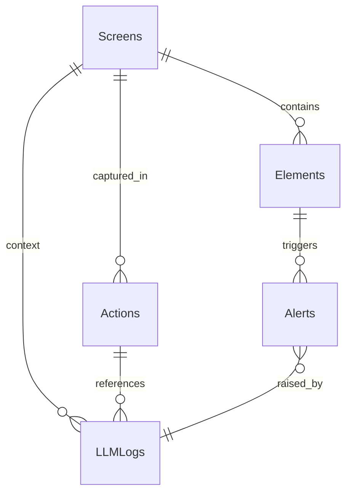

#### `Screens`

- 主键：`id (uuid)`，唯一索引 `signature`。
- 字段：`app_id`、`app_version`、`signature`、`screenshot_path`、`dom_hash`、`primary_text`、`captured_at`、`device_model`。
- 索引：`(app_id, app_version)`、`captured_at DESC`。
- 留存：截图存 MinIO，表记录保留 365 天。

#### `Elements`

- 主键：`id (uuid)`，外键 `screen_id`。
- 字段：`locator_type`、`locator_value`、`confidence`、`verification_status`、`visual_bbox`、`ocr_text`、`dynamic_flags`、`version`。
- 索引：`(screen_id, confidence DESC)`、`locator_hash`。
- 历史：按 `version` 保留最近 5 次有效定位，其余归档至历史表。

#### `Actions`

- 主键：`id (uuid)`；外键 `screen_id`、`prev_screen_id`。
- 字段：`action_type`、`params_json`、`executed_at`、`status`、`duration_ms`、`retry_count`、`llm_request_id`。
- 索引：`(screen_id, executed_at)`、`status`。
- 数据留存：180 天，失败记录永久保存以供分析。

#### `LLMLogs`

- 主键：`id (uuid)`；外键 `screen_id`、`action_id`。
- 字段：`prompt_token`、`completion_token`、`latency_ms`、`request_payload`、`response_payload`、`safety_flags`、`error_code`。
- 索引：`(created_at DESC)`、`(screen_id, created_at)`。
- 脱敏：使用 JSONB 字段存储，敏感字段进行掩码。

#### `Alerts`

- 主键：`id (uuid)`；外键 `screen_id`、`element_id`、`action_id`。
- 字段：`alert_type`、`severity`、`message`、`triggered_at`、`notify_channels`、`ack_status`。
- 索引：`(alert_type, triggered_at DESC)`、`ack_status`。
- 留存：严重级别保留 1 年，其余 90 天。

### T07 对外 API 与消息队列契约

#### REST API

| Method | Path | 描述 | 主要参数 | 响应字段 | 错误码 |
| --- | --- | --- | --- | --- | --- |
| POST | `/tasks` | 创建遍历任务 | `appId`、`appVersion`、`deviceId`、`coverageProfile`、`priority` | `taskId`、`status`、`queuedAt` | `TASK_INVALID`,`DEVICE_UNAVAILABLE` |
| GET | `/tasks/{taskId}` | 查询任务状态 | `taskId` | `status`、`progress`、`coverageStats`、`lastScreen` | `TASK_NOT_FOUND` |
| GET | `/screens/{signature}` | 获取界面详情 | `signature`、`appVersion?` | `screenMeta`、`elements[]`、`latestActions[]` | `SCREEN_NOT_FOUND` |
| GET | `/alerts` | 告警列表 | `severity?`、`status?`、`from?`、`to?` | `alerts[]`（含 `ackStatus`、`linkedTask`） | `INVALID_RANGE` |
| POST | `/alerts/{id}/ack` | 告警确认 | `id`、`ackBy` | `ackStatus`、`ackAt` | `ALERT_NOT_FOUND` |

- 使用 NestJS `@nestjs/swagger` 输出 OpenAPI 3.1，生成 JSON Schema 供 LLM 解析。
- 所有响应外层包裹 `{"code":0,"data":...,"traceId":"..."}` 格式。
- 输入参数采用 `class-validator` 校验，错误返回 `400` 并包含字段路径。
- NestJS 模块划分：
  - `TasksModule`（控制器 + Service + Prisma Repository）；
  - `ScreensModule`（提供签名查询、MinIO 访问封装）；
  - `AlertsModule`（集成消息推送服务）；
  - `WsGateway`（使用 `@WebSocketGateway({ namespace: 'tasks' })`）；
  - 全局 `LoggingInterceptor` 记录 traceId，`ClassSerializerInterceptor` 控制字段脱敏。
- DTO 采用 `@nestjs/swagger` 的 `ApiProperty` 注解，生成 OpenAPI；使用 `Zod` 同步生成 JSON Schema，供 LLM 模型调用。

#### WebSocket

- 通道：`/ws/tasks/{taskId}`。
- 事件：`task.update`（状态变更）、`screen.new`（新界面采集）、`alert.raise`（告警）。
- 消息结构：`{event:"task.update", payload:{status, progress, traceId}}`。

#### 消息队列契约

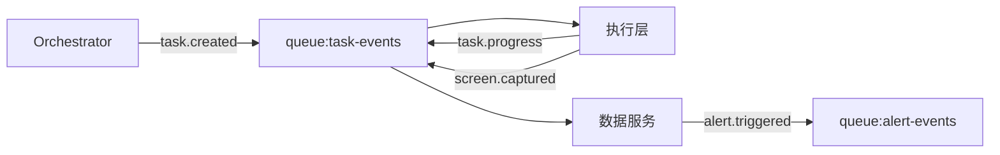

- 队列：
  - `task-events`：`taskId`、`eventType`、`payload`、`occurredAt`、`traceId`。
  - `screen-artifacts`：`taskId`、`screenSignature`、`screenshotPath`、`domPath`、`version`。
  - `alert-events`：`alertId`、`severity`、`message`、`notifyChannels`。
- 消息使用 JSON，字段遵守 snake_case；所有消息带 `checksum`，用于完整性校验。
- 保证至少一次投递，消费者需实现幂等检测（基于 `eventId`）。
- 消费端框架：执行层使用 Node.js + `bullmq` 处理 `task-events`；数据服务采用 NestJS `@nestjs/microservices` 的 Redis Transport；告警服务通过 `nestjs-telegraf` 或企业微信 SDK 推送。

### T08 可视化后台原型设计

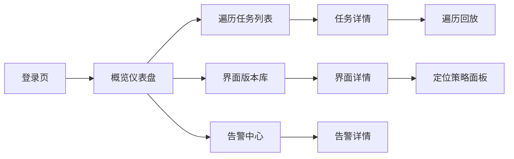

#### 页面结构

- 登录页：企业 SSO 集成，展示最近告警摘要。
- 概览仪表盘：核心指标卡片（覆盖界面数、定位成功率、告警数）、最近任务表格、告警趋势图。
- 遍历任务列表：支持按应用、状态过滤；显示进度条、开始/结束时间、设备信息。
- 任务详情：
  - 操作时间线、LLM 决策摘要、失败重试记录。
  - 支持播放遍历录像，标注定位验证结果。
- 界面版本库：缩略图墙、差异对比模式、版本筛选。
- 界面详情：展示 DOM 树、截图、定位列表、置信度曲线；可快速复制定位信息。
- 告警中心：多维过滤（类型、等级、状态）、批量确认，提供告警处理动作。

#### 交互要点

- Tailwind + shadcn/ui 组件：使用 `Card`, `Tabs`, `DataTable` 等组件快速搭建。
- 支持 dark mode；保留关键指标可视化（LineChart、BarChart），采用 `@tanstack/react-charts`。
- 所有列表支持导出 CSV，便于审计。
- 提供右侧 `Inspector` 面板展示当前选中元素的历史版本、定位策略对比。
- 组件组织：以 Feature-based 架构划分 `modules/tasks`, `modules/screens`, `modules/alerts`，每个模块内含 `pages/`, `components/`, `hooks/`, `stores/`。
- 状态同步：利用 React Query `queryClient.invalidateQueries(['tasks', taskId])` 与 WebSocket 推送结合；使用 `immer` 在 zustand store 中维护轻量 UI 状态。
- 表格组件基于 `@tanstack/react-table`，配合 shadcn/ui `Table` 自定义列筛选、排序，并通过 `export-to-csv` 输出。

#### 技术实现

- React Router 按路由拆分页面，使用 Suspense + React Query 拉取数据。
- 与后端 WebSocket 对接，实时刷新任务状态、告警数。
- 利用 `zustand` 管理全局筛选条件（应用、时间范围）。
- 表单使用 `react-hook-form` 联合 `zodResolver` 完成参数校验，UI 采用 shadcn/ui `Form` 组件；
- 全局错误边界结合 `@sentry/react` 捕获异常，提示用户并上报；
- 构建工具采用 Vite，配 `@tanstack/router-devtools` 以便调试路由状态。

### T09 运维监控与告警方案

#### 指标体系

- 设备层：`device_online_status`、`adb_disconnect_count`、`app_crash_rate`。
- 执行层：`action_success_rate`、`retry_count`、`llm_latency_ms`、`midscene_gpu_usage`。
- 数据层：`pipeline_delay_seconds`、`queue_backlog_size`、`alert_unacked_total`。
- 前端层：`ws_connection_active`、`dashboard_load_time`。

#### 告警策略

- 分级：P1（系统不可用）、P2（覆盖率大幅下降）、P3（性能下降）。
- 告警规则示例：
  - `action_success_rate < 0.9` 持续 5 分钟 → P1。
  - `midscene_gpu_usage > 80%` 持续 10 分钟 → P2。
  - `alert_unacked_total > 20` → P2。
  - `llm_latency_ms > 4000` → P3。
- 通知通道：飞书机器人、企业微信、邮件；P1 需电话通知。

#### 自动恢复

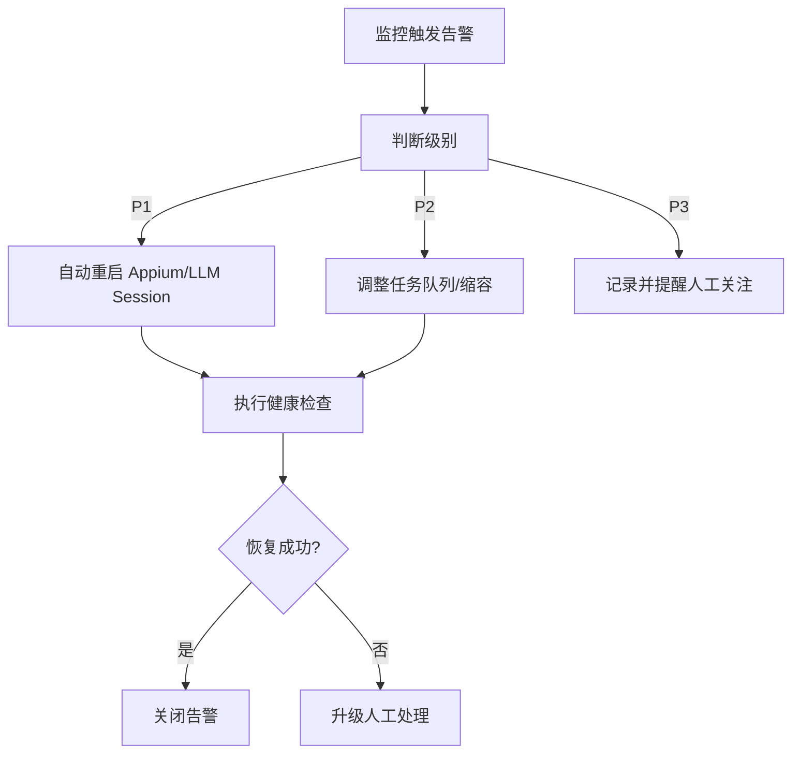

#### 运维手册

- 每日巡检：
  - 检查 GPU/设备资源、任务队列积压、告警未处理数量。
  - 验证 LLM 凭证有效性、API 配额。
- 故障处理流程：
  - 记录 `traceId`、`deviceId`、错误日志。
  - 按模块（设备、执行、数据、前端）定位，并使用预置脚本执行重启/回滚。
- 变更管理：
  - 升级前在沙箱执行全量回归遍历，生成差异报告。
  - 使用版本标签记录镜像与配置，支持一键回滚。

### T10 测试策略与验收计划

#### 用例矩阵

| 场景 | 设备 | 重点校验 | 通过标准 |
| --- | --- | --- | --- |
| 遍历主流程 | 真机 Android 13 | 状态机覆盖、LLM 指令准确率、定位验证成功率 | 覆盖 ≥50 界面，定位成功率 ≥90% |
| 异常恢复 | 真机 Android 14 + 模拟器 | App 崩溃、网络断开、LLM 超时 | 异常恢复时间 <2 分钟，任务不中断 |
| MidSceneJS 性能 | GPU 节点 | 单帧耗时、批处理吞吐 | 单帧 <500ms，批处理 10 帧 <4s |
| 数据一致性 | 后端服务 | Screens/Elements/Actions 记录完整 | 与操作日志一致，无缺失 |
| 告警链路 | 全链路 | 告警触发、通知、确认流程 | P1 告警 <1 分钟通知到人 |
| 前端展示 | 浏览器 Chrome/Edge | 仪表盘、回放、Diff、告警页 | 页面加载 <3s，无阻断性报错 |

#### 执行计划

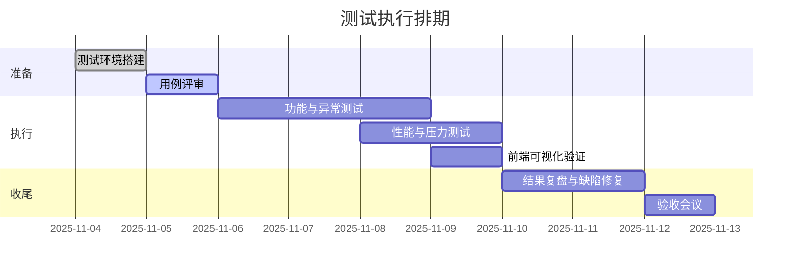

#### 验收指标

- 界面覆盖率 ≥ 80%，关键业务流程完全通过。
- 定位成功率 ≥ 90%，低置信定位占比 ≤ 5%。
- 告警误报率 ≤ 3%，漏报率 0。
- LLM 调用平均延迟 ≤ 3 s，超时率 ≤ 2%。
- 运维脚本自动恢复成功率 ≥ 85%。

#### 资源需求

- 人员：测试负责人 1 人，辅助执行 1 人，后端/前端支持各 0.5 人日。
- 环境：1 台真机、1 台 GPU 节点、1 套测试后端服务、前端部署实例。
- 数据：预置 50 条真实工单、20 条报销单；提供合法账号及权限。
