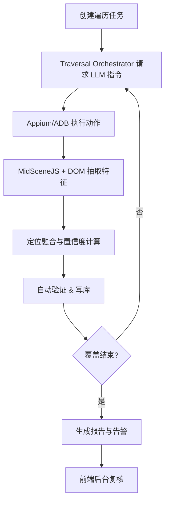
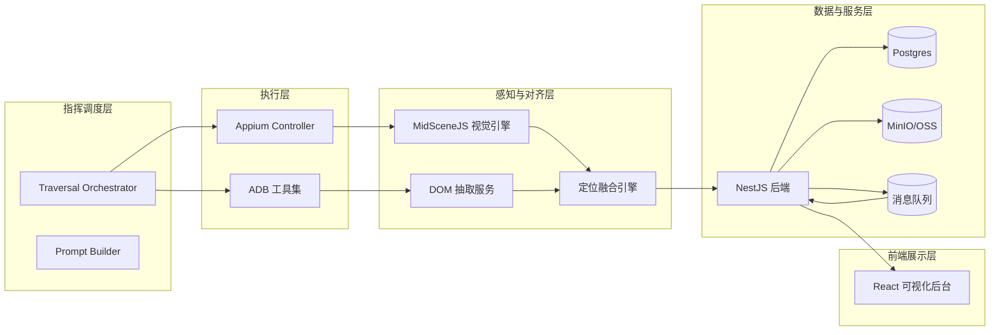

# LLM 驱动的手机端 UI 自动化定位系统 SRS / PRD

## 1. 文档概述

### 1.1 目标
- 明确系统的产品愿景、核心流程与详细功能需求。
- 为后续设计、开发、测试与运维提供统一的需求基线。

### 1.2 背景
- 当前移动端 UI 自动化脚本易受动态 ID、结构变化影响，维护成本高。
- 通过引入 Qwen3 多模态模型与 MidSceneJS 视觉引擎，期望降低定位维护成本并提升覆盖率。

### 1.3 读者
- 需求方 / 产品负责人
- 前后端研发、测试、运维工程师
- 审计、合规相关人员

## 2. 产品范围

### 2.1 In-Scope
- Android 原生 APP 的自动遍历、定位生成与验证
- 自动化遍历任务调度、执行、回放及告警
- 界面版本库、定位历史与差异分析
- 前端可视化后台用于人工复核与报告查看

### 2.2 Out-of-Scope（首期）
- iOS 平台遍历与定位
- 自动生成完整的业务自动化脚本
- 面向外部团队的大规模多租户能力

## 3. 用户画像与使用场景

- **QA 工程师**：配置遍历任务、审查定位结果、导出报告。
- **业务流程负责人**：关注核心流程的定位稳定度、接收告警。
- **运维 / DevOps**：保证执行集群、模型、队列稳定运行，处理异常。

### 3.1 关键使用流程

## 4. 系统概览

## 5. 功能需求

| ID | 模块 | 需求描述 | 触发条件 | 输出/结果 | 优先级 |
| --- | --- | --- | --- | --- | --- |
| FR-01 | 遍历任务管理 | 支持创建、编辑、删除遍历任务；配置 APP 版本、设备、覆盖范围、黑名单、优先级 | 用户在后台或 API 请求 | 任务记录、任务状态 | Must |
| FR-02 | 状态机调度 | Traversal Orchestrator 基于状态机调度遍历流程，含队列优先级与去重策略 | 任务运行时 | 执行日志、动作队列 | Must |
| FR-03 | LLM 指令生成 | 根据截图、DOM、历史操作构建 Prompt 请求 Qwen3，多模态输出结构化指令 | 状态机进入 Inspecting | JSON 动作计划、置信度 | Must |
| FR-04 | 动作安全控制 | 所有 LLM 指令需通过白名单与参数校验；违规动作拒绝 | LLM 响应后 | 审计日志、拒绝信息 | Must |
| FR-05 | 执行与回退 | Appium/ADB 执行动作，捕获异常，触发回退策略（UI Undo、App 重启、任务降级） | 指令执行失败 | 状态回退、重试计数 | Must |
| FR-06 | 视觉解析 | MidSceneJS 调用指定视觉模型（默认 Qwen3-VL）输出元素 bbox、OCR、embedding | 捕获截图时 | 视觉解析结果 | Must |
| FR-07 | 定位融合 | 将 DOM、视觉、历史数据融合生成多种定位（ID、文本、视觉模板、XPath）并计算置信度 | 完成感知后 | 定位候选集、置信度 | Must |
| FR-08 | 自动验证 | 对高置信候选执行验证（点击/高亮），验证失败触发下一候选或告警 | 生成定位后 | 验证状态、告警 | Must |
| FR-09 | 界面签名与存档 | 基于截图 hash、DOM Hash、核心文案生成界面签名，写入 Screens 表，存储截图、DOM、定位列表 | 每次遍历 | Screens / Elements / Actions 数据 | Must |
| FR-10 | 差异分析 | 对比不同版本界面的元素变化，输出 diff 报告并推送告警 | 新签名写入后 | Diff 详情、告警 | Should |
| FR-11 | 可视化后台 | 提供仪表盘、任务列表、定位详情、操作回放、告警中心等页面 | 用户登录后台 | Web 界面、导出文件 | Must |
| FR-12 | 告警通知 | 支持配置告警渠道（飞书/企业微信/邮件），按严重级别推送并支持确认流程 | 自动验证或差异分析失败 | 通知记录、告警状态 | Must |
| FR-13 | LLM 审计 | 保存 Prompt、响应、思维链、token 消耗、错误码，满足 180 天审计要求 | 每次 LLM 调用 | LLMLogs 数据、审计下载 | Must |
| FR-14 | API & WebSocket | 提供任务、界面、告警相关 REST 与订阅接口，供自动化系统与前端使用 | 第三方调用 | JSON 响应、实时事件 | Must |
| FR-15 | 多设备扩展 | 支持水平扩展，多个设备并发遍历；保留队列隔离、资源调度能力 | 未来扩展 | 多设备调度策略 | Could |

## 6. 非功能需求

| 分类 | 指标 | 目标 |
| --- | --- | --- |
| 性能 | 单设备 30 分钟遍历 ≥50 界面；定位生成延迟 <2s/元素 | Must |
| 可靠性 | 遍历任务失败率 <5%；异常自动恢复 | Must |
| 可扩展性 | 支持多设备水平扩展；视觉模型可替换 | Should |
| 安全性 | LLM 鉴权、日志脱敏、操作白名单、审计留存 ≥180 天 | Must |
| 可维护性 | 模块化设计，单元测试覆盖率 ≥70%，文档完备 | Should |

## 7. 技术栈

### 7.1 前端（可视化后台）

| 层级 | 技术/框架 | 说明 |
| --- | --- | --- |
| 基础语言 | TypeScript 5.x | 强类型支撑复杂交互 |
| 框架 | React 18 + React Router | 构建 SPA，按路由拆分页面 |
| UI | TailwindCSS, shadcn/ui | 快速构建统一风格组件 |
| 状态管理 | React Query, Zustand, Immer | 数据请求缓存、UI 状态管理 |
| 可视化 | @tanstack/react-charts, @tanstack/react-table | 指标图表与可配置表格 |
| 表单校验 | react-hook-form + Zod | 保障输入合规，生成 JSON Schema |
| 构建工具 | Vite | 快速开发与打包 |
| 监控/异常 | Sentry（@sentry/react） | 捕获前端异常并告警 |
| 实时通信 | WebSocket + React Query 订阅 | 同步任务与告警状态 |

### 7.2 后端服务（数据与 API 层）

| 层级 | 技术/框架 | 说明 |
| --- | --- | --- |
| 基础语言 | TypeScript + Node.js 20 LTS | 与前端一致的技术栈 |
| 主框架 | NestJS | 模块化架构、依赖注入、Swagger 支持 |
| ORM/数据访问 | Prisma（或 TypeORM） | 对接 Postgres，生成类型安全的 Repository |
| 数据库 | Postgres | 存储 Screens、Elements、Actions、LLMLogs、Alerts |
| 对象存储 | MinIO / OSS | 存储截图、DOM 文件、回放录像 |
| 队列 | Redis Streams / BullMQ / Kafka (可选) | 传递任务事件、告警事件 |
| 缓存 | Redis | 缓存界面解析、MidScene 结果 |
| 身份鉴权 | 企业 SSO / OpenID | 后台登录、API 控制 |
| 日志 | Winston + OpenTelemetry | 统一 traceId、采集指标 |
| API 契约 | @nestjs/swagger + Zod | 输出 OpenAPI 3.1 与 JSON Schema |

### 7.3 执行与感知层

| 层级 | 技术/框架 | 说明 |
| --- | --- | --- |
| 自动化驱动 | Appium Server 2.x | 控制 Android 真机/模拟器 |
| 设备控制 | ADB, uiautomator2 driver, Espresso driver | 获取节点信息、执行操作 |
| 视觉解析 | MidSceneJS, Qwen3-VL | 视觉语言模型定位控件 |
| 多模态模型 | Qwen3-VL（可扩 Doubao、Gemini） | 解析截图、生成语义 |
| 脚本语言 | TypeScript + MidSceneJS SDK | 封装视觉调用与动作执行 |

### 7.4 运维与监控

| 层级 | 技术/框架 | 说明 |
| --- | --- | --- |
| 监控 | Prometheus, Grafana | 指标采集、可视化 |
| 日志 | Loki / ELK | 聚合执行层与后端日志 |
| 告警 | 飞书 Webhook、企业微信机器人、邮件 | 多渠道告警触达 |
| 部署 | Docker, Kubernetes, Helm | 统一部署与扩缩容 |
| 密钥管理 | Vault / KMS | 管理 LLM、MidScene、数据库密钥 |

## 8. 依赖与假设

- 需要至少 1 台 Android 真机 + 1 套模拟器，具备公司 VPN 与 MDM。
- GPU 节点需满足 MidSceneJS 的 CUDA 要求（建议 NVIDIA T4 及以上）。
- 企业级 Qwen3 多模态 API Key 已在网关注册并可调用。
- Postgres、MinIO、Redis、消息队列等基础设施由内部平台提供。

## 9. 风险与应对

| 风险 | 影响 | 应对策略 |
| --- | --- | --- |
| 视觉模型误判 | 误操作、覆盖不足 | 动作白名单、人工复核、视觉缓存回放 |
| 动态属性频繁变化 | 定位失效 | 组合定位 + 置信度降权 + 历史对比 |
| GPU 资源不足 | 解析延迟上升 | 缓存策略、批量调度、GPU 监控与自动扩容 |
| 设备稳定性差 | 遍历中断 | 真机+模拟器混合、自动重连、任务回退 |
| 成本控制 | 超预算 | Token 缓存、重复界面复用历史数据 |

## 10. 里程碑（建议）

| 阶段 | 里程碑 | 交付物 |
| --- | --- | --- |
| M1 (第 2 周) | Appium + MidSceneJS + Qwen 多模态打通 | 执行层 PoC、GPU 环境、基础监控 |
| M2 (第 4 周) | Traversal Orchestrator 原型、1 条核心流程遍历 | 状态机、动作队列、初版定位生成 |
| M3 (第 6 周) | 定位生成与验证、界面版本库/diff | 完整定位数据链路、自动验证日志 |
| M4 (第 8 周) | 前端后台、告警联动、运维监控 | 仪表盘、告警通路、Prom/Grafana 仪表 |
| M5 (第 10 周) | 多设备并行、性能调优 | 多设备调度策略、性能测试报告 |

