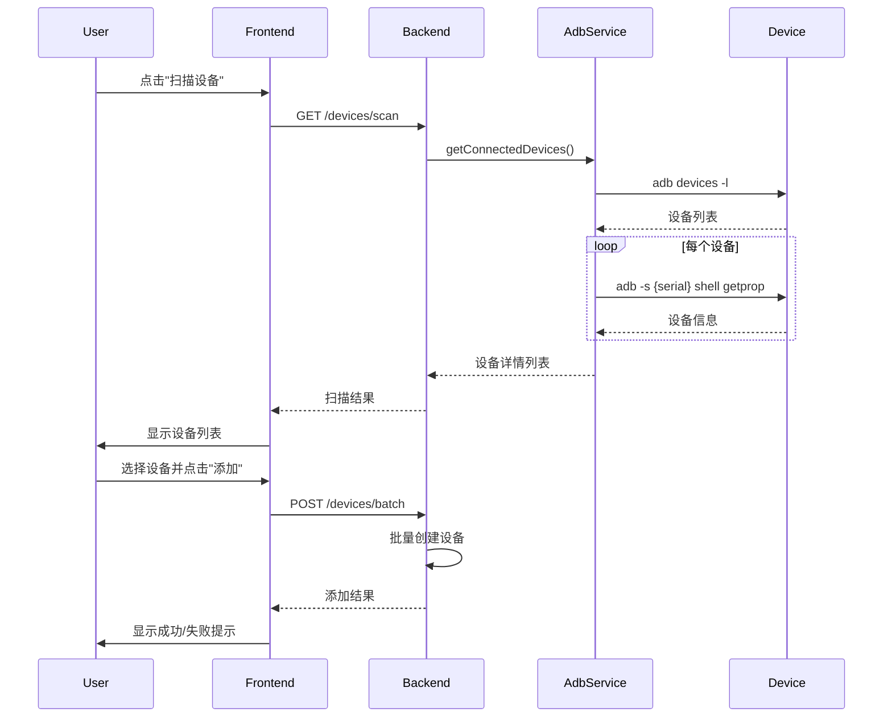

# 功能增强需求：设备自动扫描与快速添加

## 📋 需求概述

### 问题描述
**当前问题**：
- 用户需要手动输入设备序列号、型号、Android版本等信息
- 普通用户不知道如何获取设备序列号（需要执行 `adb devices` 命令）
- 手动输入容易出错，导致设备无法连接
- 用户体验差，增加了使用门槛

**影响**：
- ❌ 新用户上手困难
- ❌ 设备添加错误率高
- ❌ 需要技术背景才能使用

### 解决方案
添加**"扫描连接的设备"**功能，自动检测通过 ADB 连接到电脑的所有 Android 设备，并自动填充设备信息。

---

## 🎯 功能需求

### FR-SCAN-01: 设备自动扫描
**优先级**: P0（高优先级用户体验改进）

**需求描述**：
系统应提供"扫描设备"按钮，点击后自动检测当前通过 ADB 连接的所有 Android 设备。

**触发条件**：
- 用户在"添加设备"对话框中点击"扫描设备"按钮

**输出结果**：
- 显示检测到的设备列表，包含：
  - 设备序列号
  - 设备型号
  - Android 版本
  - 屏幕分辨率
  - 连接状态

**验收标准**：
1. ✅ 能检测到所有通过 USB/网络连接的 ADB 设备
2. ✅ 能检测到模拟器设备（如 emulator-5554）
3. ✅ 显示设备的详细信息
4. ✅ 扫描时间 < 3秒
5. ✅ 如果无设备连接，显示友好提示

---

### FR-SCAN-02: 设备快速选择添加
**优先级**: P0

**需求描述**：
用户可以从扫描结果中选择一个或多个设备，点击"添加选中设备"一键批量添加。

**触发条件**：
- 扫描完成后，用户勾选设备并点击"添加选中设备"

**输出结果**：
- 自动创建设备记录
- 自动填充所有必需字段
- 显示添加成功/失败结果

**验收标准**：
1. ✅ 支持单选和多选设备
2. ✅ 自动填充序列号、型号、Android版本、分辨率
3. ✅ 设备类型自动判断（真机/模拟器）
4. ✅ 批量添加时显示进度
5. ✅ 添加失败时显示具体错误信息

---

### FR-SCAN-03: 手动输入保留
**优先级**: P1

**需求描述**：
保留手动输入设备信息的功能，用于特殊场景（如远程设备）。

**触发条件**：
- 用户点击"手动添加"或扫描失败时

**验收标准**：
1. ✅ "扫描设备"和"手动添加"可切换
2. ✅ 手动添加流程保持不变
3. ✅ 扫描后仍可手动编辑设备信息

---

## 🔧 技术设计

### 后端 API 设计

#### 1. 扫描设备 API

**端点**: `GET /api/v1/devices/scan`

**描述**: 扫描当前连接的 ADB 设备

**响应**:
```typescript
{
  code: 0,
  message: "扫描成功",
  data: {
    devices: [
      {
        serial: "emulator-5554",
        model: "Pixel 6",
        androidVersion: "13",
        resolution: "1080x2400",
        deviceType: "EMULATOR",
        status: "ONLINE",
        manufacturer: "Google",
        battery: 100,
        wifiEnabled: true
      },
      {
        serial: "1A2B3C4D",
        model: "Samsung Galaxy S21",
        androidVersion: "12",
        resolution: "1440x3200",
        deviceType: "REAL",
        status: "ONLINE",
        manufacturer: "Samsung",
        battery: 85,
        wifiEnabled: true
      }
    ],
    total: 2,
    scannedAt: "2025-11-05T15:30:00Z"
  }
}
```

**错误响应**:
```typescript
// 无设备连接
{
  code: 404,
  message: "未检测到连接的设备",
  data: {
    suggestion: "请确保设备已通过USB连接并开启USB调试"
  }
}

// ADB 未安装
{
  code: 500,
  message: "ADB服务不可用",
  data: {
    suggestion: "请安装Android SDK并配置ADB环境变量"
  }
}
```

#### 2. 批量添加设备 API

**端点**: `POST /api/v1/devices/batch`

**请求体**:
```typescript
{
  devices: [
    {
      serialNumber: "emulator-5554",
      model: "Pixel 6",
      androidVersion: "13",
      type: "EMULATOR",
      resolution: "1080x2400",
      tags: ["测试", "模拟器"]
    }
  ]
}
```

**响应**:
```typescript
{
  code: 0,
  message: "批量添加完成",
  data: {
    success: [
      {
        id: "uuid-1",
        serialNumber: "emulator-5554",
        message: "添加成功"
      }
    ],
    failed: [
      {
        serialNumber: "1A2B3C4D",
        error: "设备已存在",
        code: "DEVICE_EXISTS"
      }
    ],
    total: 2,
    successCount: 1,
    failedCount: 1
  }
}
```

---

### 后端实现

#### DevicesService 新增方法

```typescript
/**
 * 扫描连接的设备
 * 调用 ADB service 获取设备列表及详细信息
 */
async scanDevices(): Promise<ScanDeviceDto[]> {
  // 1. 调用 adb devices -l 获取设备列表
  // 2. 对每个设备获取详细信息：
  //    - adb -s {serial} shell getprop ro.product.model
  //    - adb -s {serial} shell getprop ro.build.version.release
  //    - adb -s {serial} shell wm size
  //    - adb -s {serial} shell getprop ro.product.manufacturer
  // 3. 判断设备类型（序列号包含"emulator"为模拟器）
  // 4. 返回设备信息列表
}

/**
 * 批量添加设备
 */
async batchCreate(devices: CreateDeviceDto[]): Promise<BatchCreateResult> {
  // 1. 遍历设备列表
  // 2. 对每个设备调用 create 方法
  // 3. 收集成功和失败结果
  // 4. 返回批量添加结果
}
```

#### AdbService 新增方法

```typescript
/**
 * 获取所有连接的设备
 */
async getConnectedDevices(): Promise<AdbDevice[]> {
  // 执行: adb devices -l
  // 解析输出
}

/**
 * 获取设备详细信息
 */
async getDeviceInfo(serial: string): Promise<DeviceInfo> {
  // 获取型号、版本、分辨率等
}

/**
 * 判断是否为模拟器
 */
isEmulator(serial: string): boolean {
  return serial.startsWith('emulator-');
}
```

---

### 前端 UI 设计

#### 设备添加对话框改进

```tsx
┌─────────────────────────────────────────────────┐
│  添加设备                                 [X]   │
├─────────────────────────────────────────────────┤
│                                                  │
│  ┌──────────────┐  ┌──────────────┐            │
│  │ 🔍 扫描设备  │  │ ✏️ 手动添加  │  ← Tab切换 │
│  └──────────────┘  └──────────────┘            │
│                                                  │
│  ┌────────────────────────────────────────┐    │
│  │ 扫描中...                              │    │
│  │ ▓▓▓▓▓▓▓▓▓░░░░░░░  60%                 │    │
│  └────────────────────────────────────────┘    │
│                                                  │
│  检测到 2 台设备：                              │
│  ┌────────────────────────────────────────┐    │
│  │ ☑ emulator-5554                    在线│    │
│  │   📱 Pixel 6 • Android 13           │    │
│  │   📏 1080x2400 • 🔋 100%            │    │
│  │   🏷️ 模拟器                         │    │
│  ├────────────────────────────────────────┤    │
│  │ ☐ 1A2B3C4D                        在线│    │
│  │   📱 Galaxy S21 • Android 12        │    │
│  │   📏 1440x3200 • 🔋 85%             │    │
│  │   🏷️ 真机                           │    │
│  └────────────────────────────────────────┘    │
│                                                  │
│  已选择: 1 台设备                               │
│                                                  │
│  ┌──────────────────────────────────────┐      │
│  │ 取消  │  重新扫描  │  添加选中设备  │      │
│  └──────────────────────────────────────┘      │
└─────────────────────────────────────────────────┘
```

#### 手动添加模式（保留原有）

```tsx
┌─────────────────────────────────────────────────┐
│  添加设备                                 [X]   │
├─────────────────────────────────────────────────┤
│                                                  │
│  ┌──────────────┐  ┌──────────────┐            │
│  │ 🔍 扫描设备  │  │ ✏️ 手动添加  │  ← 当前   │
│  └──────────────┘  └──────────────┘            │
│                                                  │
│  序列号 *                                       │
│  ┌────────────────────────────────────────┐    │
│  │ emulator-5554                          │    │
│  └────────────────────────────────────────┘    │
│                                                  │
│  型号 *                                         │
│  ┌────────────────────────────────────────┐    │
│  │ Pixel 6                                │    │
│  └────────────────────────────────────────┘    │
│                                                  │
│  ... (其他字段保持不变)                        │
│                                                  │
└─────────────────────────────────────────────────┘
```

---

### 前端实现

#### 新增 API 方法

```typescript
// frontend/src/lib/api/devices.ts

export class DevicesApi {
  /**
   * 扫描连接的设备
   */
  static async scanDevices(): Promise<ScanDeviceResult> {
    return ApiClient.get('/devices/scan');
  }

  /**
   * 批量添加设备
   */
  static async batchCreateDevices(devices: CreateDeviceDto[]): Promise<BatchCreateResult> {
    return ApiClient.post('/devices/batch', { devices });
  }
}
```

#### 组件状态管理

```typescript
// DeviceList.tsx

const [scanMode, setScanMode] = useState<'scan' | 'manual'>('scan');
const [scannedDevices, setScannedDevices] = useState<ScannedDevice[]>([]);
const [selectedDevices, setSelectedDevices] = useState<Set<string>>(new Set());
const [isScanning, setIsScanning] = useState(false);
const [scanProgress, setScanProgress] = useState(0);

// 扫描设备
const scanDevicesMutation = useMutation({
  mutationFn: () => DevicesApi.scanDevices(),
  onSuccess: (data) => {
    setScannedDevices(data.devices);
  },
});

// 批量添加
const batchCreateMutation = useMutation({
  mutationFn: (devices: CreateDeviceDto[]) => 
    DevicesApi.batchCreateDevices(devices),
  onSuccess: (result) => {
    // 显示成功/失败结果
    queryClient.invalidateQueries({ queryKey: ['devices'] });
    setCreateDialogOpen(false);
  },
});
```

---

## 🎨 UI/UX 细节

### 扫描流程

1. **初始状态**
   - 显示"扫描设备"和"手动添加"两个标签页
   - 默认显示"扫描设备"页

2. **扫描中**
   - 显示进度条和提示文字
   - 按钮变为"扫描中..."并禁用

3. **扫描成功**
   - 显示设备列表（卡片或列表形式）
   - 每个设备显示复选框、图标、详细信息
   - 底部显示"已选择 X 台设备"
   - "添加选中设备"按钮可用

4. **扫描失败/无设备**
   - 显示友好的空状态
   - 提供帮助提示（如何连接设备、开启USB调试）
   - 提供"重新扫描"按钮

### 设备卡片设计

```
┌─────────────────────────────────────┐
│ ☑  📱 emulator-5554         ● 在线 │
│                                     │
│    型号：Pixel 6                    │
│    系统：Android 13                 │
│    分辨率：1080x2400                │
│    类型：🖥️ 模拟器                  │
│    电量：🔋 100%                    │
└─────────────────────────────────────┘
```

### 交互细节

- **全选/取消全选**：列表顶部提供全选按钮
- **设备状态标识**：在线（绿点）、离线（灰点）
- **设备类型图标**：真机（📱）、模拟器（🖥️）
- **电量显示**：使用图标+百分比
- **错误提示**：Toast 通知，显示具体错误

---

## 📊 数据流设计



---

## ✅ 验收标准

### 功能验收

- [ ] 能成功扫描所有通过 ADB 连接的设备
- [ ] 扫描结果包含所有必需字段
- [ ] 能正确识别设备类型（真机/模拟器）
- [ ] 支持单选和多选设备
- [ ] 批量添加设备成功
- [ ] 重复设备提示清晰
- [ ] 扫描失败时有友好提示

### 性能验收

- [ ] 扫描 1-5 台设备耗时 < 3秒
- [ ] 批量添加 10 台设备耗时 < 5秒
- [ ] UI 响应流畅，无卡顿

### 用户体验验收

- [ ] 新用户无需培训即可完成设备添加
- [ ] 错误提示清晰易懂
- [ ] 操作流程简洁（3步内完成）

---

## 📝 开发任务分解

### 后端任务

- [ ] Task 1: 实现 AdbService.getConnectedDevices()
- [ ] Task 2: 实现 AdbService.getDeviceInfo()
- [ ] Task 3: 实现 DevicesService.scanDevices()
- [ ] Task 4: 实现 DevicesController.scanDevices() API
- [ ] Task 5: 实现 DevicesService.batchCreate()
- [ ] Task 6: 实现 DevicesController.batchCreate() API
- [ ] Task 7: 添加单元测试
- [ ] Task 8: 添加 Swagger 文档

### 前端任务

- [ ] Task 1: 实现 DevicesApi.scanDevices()
- [ ] Task 2: 实现 DevicesApi.batchCreateDevices()
- [ ] Task 3: 改造 DeviceList.tsx 添加扫描模式
- [ ] Task 4: 实现设备扫描 UI
- [ ] Task 5: 实现设备选择交互
- [ ] Task 6: 实现批量添加流程
- [ ] Task 7: 添加加载状态和错误处理
- [ ] Task 8: 优化响应式布局

### 测试任务

- [ ] Task 1: 编写后端单元测试
- [ ] Task 2: 编写后端集成测试
- [ ] Task 3: 编写前端组件测试
- [ ] Task 4: 端到端测试（真实设备）
- [ ] Task 5: 边界情况测试（无设备、ADB异常等）

---

## 📅 实施计划

### Phase 1: 后端开发（预计 2-3小时）
1. ADB 服务扩展
2. 设备扫描 API
3. 批量添加 API
4. 单元测试

### Phase 2: 前端开发（预计 2-3小时）
1. API 集成
2. UI 组件开发
3. 交互逻辑
4. 错误处理

### Phase 3: 测试与优化（预计 1-2小时）
1. 集成测试
2. 端到端测试
3. 性能优化
4. 用户体验优化

**总计**: 5-8 小时

---

## 🔗 相关文档

- [PRD需求文档](./PRD需求.md)
- [原型设计](./原型设计.md)
- [数据库设计](./数据库设计.md)
- [测试计划](../testing/TEST-PLAN.md)

---

**文档版本**: v1.0  
**创建日期**: 2025-11-05  
**最后更新**: 2025-11-05  
**负责人**: AI Assistant  
**状态**: ✅ 需求确认完成，待实现

