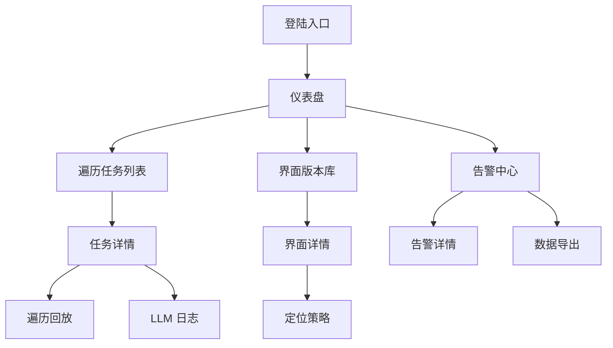

# LLM 驱动的手机端 UI 自动化定位系统 — 原型设计说明

## 1. 原型设计范围

- **依据文档**：
  - 《PRD需求.md》中的业务目标、功能需求、技术栈约束
  - 《界面设计.md》中的视觉体系、组件与交互规范
- **原型类型**：中高保真框架图（Wireframe + UI References），用于确认信息架构、交互流程与关键状态。
- **交付目标**：为 Figma 原型搭建提供结构化说明，确保各角色对界面行为保持一致认知。

## 2. 原型总览与用户流程

> 所有页面沿用 Bento + Glassmorphism 风格，遵循 Bootstrap 栅格布局与 FontAwesome 图标规范。

## 3. 页面级原型说明

### 3.1 登录 / 权限管理

- **布局**：全屏玻璃背景 + 中央 480px 宽卡片；卡片包含 Logo、欢迎语、单点登录按钮。
- **交互**：按钮默认透明渐变，hover 提亮；登录成功后跳转 Dashboard；失败时卡片顶部出现错误条。
- **辅助元素**：底部提供“查看系统公告”“联系运维”链接。

### 3.2 仪表盘（Dashboard）

- **结构**：
  - 顶部信息条：任务概览、覆盖率、LLM Token 使用，使用 12 列满宽 Bento 卡片
  - 中央 KPI 区块：18px 圆角卡片 6/6 排列，含微型趋势图
  - 下方分栏：左侧「最新遍历任务」列表（8 列），右侧「告警时间线」(4 列)
- **交互**：
  - KPI 卡片点击跳转至对应详情
  - 告警时间线 hover 展示操作按钮（确认/查看）
- **反馈**：加载中使用 Skeleton；数据刷新时卡片顶部出现微动动画条。

### 3.3 遍历任务列表

- **过滤区**：顶部 2 行，第一行 Tabs（全部/运行中/失败），第二行筛选 Chips（应用、设备、优先级、日期）与搜索框。
- **列表区**：Bootstrap 表格 + 固定列，包含任务名称、应用版本、设备、进度条、状态徽章、操作按钮。
- **空状态**：插入自定义插图 + CTA 创建任务；失败时带重试按钮。

### 3.4 遍历任务详情

- **布局**：左侧固定信息面板（任务信息、设备、覆盖配置）；右侧 Tabs：
  1. **操作时间线**：垂直 Stepper + 时间戳 + JSON 摘要；支持筛选（全部/成功/失败）
  2. **定位验证**：表格 + 卡片展示定位候选，包含置信度柱状条、验证截图
  3. **LLM 日志**：JSON Viewer + Token 消耗图
- **回放区**：顶部右侧按钮打开全屏模态，展示遍历录像（含控件高亮层）
- **交互状态**：
  - Stepper 节点 hover 高亮；失败节点展示错误气泡
  - LLM 日志区支持 JSON 折叠/展开，复制按钮 hover 变色

### 3.5 界面版本库

- **布局**：Bento Gallery，按 4/4/4 列排列缩略图卡片。卡片包含：界面签名、版本号、定位成功率 tag、时间戳。
- **筛选**：顶部 Chips 控制应用、版本、定位状态；支持关键词搜索。
- **交互**：
  - 卡片 hover：放大 2%，显示“查看详情”浮动按钮
  - 多选模式：点击“对比”后卡片出现勾选框

### 3.6 界面详情 / 定位面板

- **结构**：
  - 左侧大图（支持 2x Retina，提供放大镜控件）
  - 右侧 Info Panel：定位列表（按置信度排序）、置信度折线图、最近验证记录
- **Tabs**：
  - `定位策略`：展示不同策略卡片（ID/Text/视觉模板）
  - `历史验证`：时间轴 + 结果卡片
  - `差异对比`：左右分屏 diff（滑动条控制覆盖程度）
- **交互**：
  - 定位卡片 hover：显示“复制”按钮；点击折叠显示详细参数
  - 差异对比提供“高亮差异”“显示新增/删除元素”开关

### 3.7 告警中心

- **布局**：
  - 左侧过滤面板（Severity、状态、应用、时间范围）
  - 右侧列表：卡片式告警条目，顶部 Severity Tag，正文展示描述与触发条件
- **详情弹窗**：
  - 上半部分告警描述，下半部分处理记录时间线 + 操作按钮（确认、忽略、指派）
- **交互**：
  - 列表 hover：背景出现轻微光晕
  - 激活告警：卡片左侧出现 Accent 色条

### 3.8 数据导出 / 报告

- **界面**：模态框，包含导出格式（CSV/JSON/PDF）、时间范围、过滤条件
- **交互**：
  - 表单实时校验；下载按钮显示进度条
  - 导出完成后显示成功提示 + 下载链接

## 4. 交互状态与微动效

| 组件 | 默认 | 悬停 | 点击/激活 | 禁用 |
| --- | --- | --- | --- | --- |
| 主按钮 | 主色实心，文本白 | 背景加深 8%，阴影增强 | 背景暗 12%，内阴影 | 15% 透明，文本 40% 白 |
| Ghost 按钮 | 透明边框 + 文本主色 | 背景出现 12% 主色 | 背景 24% 主色 + 文本白 | 透明 20%，文本 40% |
| 卡片 | 玻璃背景 + 细光晕 | 提升高度，光斑漂移 | 点击出现 80ms 压下动效 | 透明度 60%，禁止光斑 |
| 表格行 | 深色背景 | 背景亮度 +12% | 选中出现左侧 Accent 条 | 文字 40%，不可互动 |
| Chips | 深色边框 + 文本浅色 | 背景主色 12% | 背景主色 24%，文本白 | 透明度 50% |

**微动效建议**：
- 全局 200~280ms ease-out；使用 `transform` + `opacity`
- 页面切换使用“卡片滑入 + 渐变过渡”，保持视觉连续性
- 告警条目更新时闪烁 Accent 色条 1 次，时长 400ms

## 5. 表单与反馈机制

- **表单原则**：
  - 使用浮动标签，提示文字占位；必填项以 `*` 标记
  - 实时校验：输入失焦触发，错误提示淡入出现
- **反馈**：
  - 成功：Toast（右下角）+ 顶部信息条插入“操作成功”卡片
  - 错误：表单顶部 Danger Alert + 错误字段高亮
  - 任务重新运行：显示确认模态 + 进度提示条

## 6. 响应式布局策略

- **桌面端 (≥1280px)**：保留完整 Bento 栅格，侧栏固定；信息密度高
- **平板端 (768~1024px)**：侧栏收缩为图标栏或顶部导航；卡片改为 2 列堆叠；表格进入紧凑模式
- **移动端 (≤428px)**：所有卡片改为纵向列表；过滤器改为底部滑出；表格转卡片式显示（包含关键字段 + 操作按钮）
- **断点参照**：Bootstrap 默认 `xxl (≥1400) / xl (≥1200) / lg (≥992) / md (≥768) / sm (≥576) / xs (<576)`，并补充 `1920` 自定义断点

## 7. 可访问性与性能

- 组件 focus 状态使用明显的绿色描边（对应界面设计规范），并确保 tab 顺序与视觉一致
- 所有图标按钮提供 `aria-label`，图像卡片添加 `figcaption`
- 在原型中标注色彩对比值，确保≥4.5:1；暗色背景叠加渐变时附加深色遮罩
- 调整动效用于“prefers-reduced-motion”配置：在原型上说明可通过设置开关禁用大部分动效

## 8. 性能与实现提示

- 图像预览采用懒加载 + 细粒度占位（模糊渐进）
- LLM 日志与定位详情表格提供分页 / 虚拟滚动说明
- 告警中心列表建议 200 条以内，提供“更多”加载说明

## 9. 原型交付建议

1. 在 Figma 创建 Page：`01 Dashboard`、`02 Tasks`、`03 Screens`、`04 Alerts`、`05 Settings`
2. 利用 AutoLayout 构建 Bento 卡片，统一 24px 圆角、16px 内边距、32px 卡片间距
3. 添加交互原型链接：
   - KPI 卡片 → 任务详情
   - 告警条目 → 告警详情弹窗
   - 定位卡片 “复制” → 反馈 toast
4. 预留 Design Token 说明（颜色、字体、阴影、边框）以便前端引用 Bootstrap 变量

