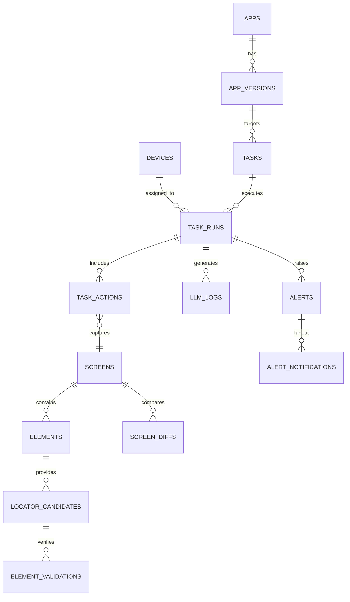

# LLM 驱动的手机端 UI 自动化定位系统 — 数据库设计

## 1. 设计目标

- 支撑遍历任务、界面资产、定位策略与告警全链路的数据存储需求。
- 提供可扩展的数据模型，适配未来多设备并发与多模型协同。
- 确保数据可追溯、可审计，满足 180 天日志留存与安全合规要求。
- 兼容 Prisma / TypeORM 的实体生成，同时优化 Postgres 的性能与成本。

## 2. 核心实体关系

以下 ER 图概览主要实体及关联关系：

> 说明：`TASK_ACTIONS` 中的截图、DOM 等大文件引用统一指向对象存储（MinIO/OSS）。

## 3. 表结构定义

以下表按数据域划分，字段类型采用 Postgres 推荐类型；若无特殊说明，`created_at`、`updated_at` 字段均为 `TIMESTAMPTZ` 并由数据库自动维护。

### 3.1 应用维度

#### 3.1.1 `apps`

| 字段 | 类型 | 约束 | 说明 |
| --- | --- | --- | --- |
| id | UUID | PK | 应用唯一标识 |
| name | TEXT | NOT NULL, UNIQUE | 应用名称（如“企业审批中心”） |
| package_name | TEXT | NOT NULL, UNIQUE | Android 包名 |
| description | TEXT |  | 应用说明 |
| created_at | TIMESTAMPTZ | NOT NULL, DEFAULT now() | 创建时间 |
| updated_at | TIMESTAMPTZ | NOT NULL, DEFAULT now() | 更新时间 |

索引：`idx_apps_package_name` (UNIQUE)。

#### 3.1.2 `app_versions`

| 字段 | 类型 | 约束 | 说明 |
| --- | --- | --- | --- |
| id | UUID | PK |
| app_id | UUID | FK -> apps.id, NOT NULL |
| version_name | TEXT | NOT NULL |
| version_code | INTEGER |  | 可选的版本号 |
| changelog | TEXT |  | 版本说明 |
| apk_hash | TEXT |  | APK 哈希校验 |
| released_at | TIMESTAMPTZ |  | 上线时间 |
| created_at | TIMESTAMPTZ | NOT NULL |

约束：`UNIQUE(app_id, version_name)`。

### 3.2 设备与任务域

#### 3.2.1 `devices`

| 字段 | 类型 | 约束 | 说明 |
| --- | --- | --- | --- |
| id | UUID | PK |
| serial | TEXT | NOT NULL, UNIQUE | 设备序列号 / 模拟器 ID |
| model | TEXT | NOT NULL | 设备型号 |
| os_version | TEXT | NOT NULL | Android 版本 |
| device_type | TEXT | NOT NULL | `enum('REAL','EMULATOR')` |
| resolution | TEXT |  | 1080x1920 等 |
| status | TEXT | NOT NULL | `enum('AVAILABLE','BUSY','OFFLINE','DECOMMISSIONED')` |
| tags | JSONB |  | MDM、地理位置等 |
| last_heartbeat_at | TIMESTAMPTZ |  | 最近心跳 |
| created_at | TIMESTAMPTZ | NOT NULL |

索引：`idx_devices_status`、`gin_devices_tags` (GIN on tags)。

#### 3.2.2 `tasks`

| 字段 | 类型 | 约束 | 说明 |
| --- | --- | --- | --- |
| id | UUID | PK |
| app_version_id | UUID | FK -> app_versions.id, NOT NULL |
| name | TEXT | NOT NULL | 任务名称 |
| coverage_profile | TEXT | NOT NULL | `enum('FULL','SMOKE','CUSTOM')` |
| coverage_config | JSONB |  | 黑名单、优先级配置 |
| priority | INTEGER | NOT NULL | 1(最高)~5 |
| status | TEXT | NOT NULL | `enum('DRAFT','QUEUED','RUNNING','PAUSED','COMPLETED','FAILED')` |
| created_by | UUID |  | 企业用户 ID（可对接 SSO） |
| schedule_at | TIMESTAMPTZ |  | 计划启动时间 |
| created_at | TIMESTAMPTZ | NOT NULL |
| updated_at | TIMESTAMPTZ | NOT NULL |

索引：`idx_tasks_status_priority` (status, priority), `idx_tasks_app_ver` (app_version_id)。

#### 3.2.3 `task_runs`

| 字段 | 类型 | 约束 | 说明 |
| --- | --- | --- | --- |
| id | UUID | PK |
| task_id | UUID | FK -> tasks.id, NOT NULL |
| device_id | UUID | FK -> devices.id, NOT NULL |
| orchestrator_version | TEXT | NOT NULL | 当前调度服务版本 |
| status | TEXT | NOT NULL | `enum('RUNNING','SUCCEEDED','FAILED','CANCELLED')` |
| start_at | TIMESTAMPTZ | NOT NULL |
| end_at | TIMESTAMPTZ |  | 结束时间 |
| total_actions | INTEGER | DEFAULT 0 |
| successful_actions | INTEGER | DEFAULT 0 |
| coverage_screens | INTEGER | DEFAULT 0 |
| failure_reason | TEXT |  | 失败说明 |
| metrics | JSONB |  | 额外指标（LLM 延迟、GPU 使用等） |
| created_at | TIMESTAMPTZ | NOT NULL |

索引：`idx_task_runs_task_status`、`idx_task_runs_device_time`。

#### 3.2.4 `task_run_events`

用于记录状态机事件与关键日志，方便回放。

| 字段 | 类型 | 约束 | 说明 |
| --- | --- | --- | --- |
| id | BIGSERIAL | PK |
| task_run_id | UUID | FK -> task_runs.id, NOT NULL |
| event_type | TEXT | NOT NULL | `enum('STATE_CHANGE','ERROR','RECOVERY','NOTICE')` |
| detail | JSONB | NOT NULL | 事件详情（包含 state_from/state_to、消息等） |
| occurred_at | TIMESTAMPTZ | NOT NULL |

索引：`idx_task_run_events_run_time`。

### 3.3 操作与界面资产

#### 3.3.1 `task_actions`

| 字段 | 类型 | 约束 | 说明 |
| --- | --- | --- | --- |
| id | UUID | PK |
| task_run_id | UUID | FK -> task_runs.id, NOT NULL |
| sequence | INTEGER | NOT NULL | 动作顺序 |
| action_type | TEXT | NOT NULL | `enum('CLICK','INPUT','SCROLL','NAVIGATE','CUSTOM')` |
| params | JSONB | NOT NULL | LLM 返回参数 |
| status | TEXT | NOT NULL | `enum('PENDING','SUCCESS','FAILED','SKIPPED')` |
| started_at | TIMESTAMPTZ |  |
| completed_at | TIMESTAMPTZ |  |
| duration_ms | INTEGER |  |
| error_code | TEXT |  |
| error_message | TEXT |  |
| llm_log_id | UUID | FK -> llm_logs.id | 关联 LLM 请求 |
| screen_id | UUID | FK -> screens.id | 动作后捕获的界面 |
| created_at | TIMESTAMPTZ | NOT NULL |

索引：`idx_task_actions_run_sequence`、`idx_task_actions_status`。

#### 3.3.2 `screens`

| 字段 | 类型 | 约束 | 说明 |
| --- | --- | --- | --- |
| id | UUID | PK |
| app_version_id | UUID | FK -> app_versions.id, NOT NULL |
| signature | TEXT | NOT NULL | 截图 hash + 文案等生成的唯一签名 |
| dom_hash | TEXT | NOT NULL |
| primary_text | TEXT |  | 主文案摘要 |
| screenshot_path | TEXT | NOT NULL | MinIO 对象路径 |
| screenshot_thumb_path | TEXT |  | 缩略图路径 |
| dom_path | TEXT | NOT NULL | DOM JSON 存储路径 |
| orientation | TEXT | NOT NULL | `enum('PORTRAIT','LANDSCAPE')` |
| width | INTEGER | NOT NULL |
| height | INTEGER | NOT NULL |
| captured_at | TIMESTAMPTZ | NOT NULL |
| device_model | TEXT |  |
| source_task_run_id | UUID | FK -> task_runs.id |
| source_action_id | UUID | FK -> task_actions.id |
| metadata | JSONB |  | 额外信息（主题、语言等） |
| created_at | TIMESTAMPTZ | NOT NULL |

约束：`UNIQUE(app_version_id, signature)`。

索引：`idx_screens_signature`、`idx_screens_captured_at`。

#### 3.3.3 `elements`

| 字段 | 类型 | 约束 | 说明 |
| --- | --- | --- | --- |
| id | UUID | PK |
| screen_id | UUID | FK -> screens.id, NOT NULL |
| element_hash | TEXT | NOT NULL | 结合层级路径、资源 ID 生成 |
| element_type | TEXT | NOT NULL | 控件类型（className） |
| resource_id | TEXT |  |
| content_desc | TEXT |  |
| text_value | TEXT |  |
| accessibility_label | TEXT |  |
| xpath | TEXT |  |
| bounds | JSONB | NOT NULL | `{x,y,width,height}` |
| visibility | TEXT | NOT NULL | `enum('VISIBLE','HIDDEN','GONE')` |
| interactable | BOOLEAN | NOT NULL |
| version | INTEGER | NOT NULL | 元素版本号 |
| created_at | TIMESTAMPTZ | NOT NULL |
| updated_at | TIMESTAMPTZ | NOT NULL |

约束：`UNIQUE(screen_id, element_hash, version)`。

索引：`idx_elements_screen_visibility`、`gin_elements_text` (GIN on text/searchable fields via pg_trgm)。

#### 3.3.4 `locator_candidates`

| 字段 | 类型 | 约束 | 说明 |
| --- | --- | --- | --- |
| id | UUID | PK |
| element_id | UUID | FK -> elements.id, NOT NULL |
| strategy | TEXT | NOT NULL | `enum('ID','TEXT','ACCESSIBILITY_ID','XPATH','IMAGE_TEMPLATE','CUSTOM')` |
| locator_value | TEXT | NOT NULL |
| score | NUMERIC(4,3) | NOT NULL | 置信度评分 |
| source | TEXT | NOT NULL | `enum('DOM','VISION','HISTORICAL','MANUAL')` |
| is_primary | BOOLEAN | DEFAULT false |
| dynamic_flags | JSONB |  | 动态属性标记 |
| success_rate | NUMERIC(5,2) | DEFAULT 0 | 历史成功率 (%) |
| last_verified_at | TIMESTAMPTZ |  |
| created_at | TIMESTAMPTZ | NOT NULL |
| updated_at | TIMESTAMPTZ | NOT NULL |

索引：`idx_locator_element_strategy`、`idx_locator_primary`。

#### 3.3.5 `element_validations`

| 字段 | 类型 | 约束 | 说明 |
| --- | --- | --- | --- |
| id | UUID | PK |
| locator_candidate_id | UUID | FK -> locator_candidates.id, NOT NULL |
| task_run_id | UUID | FK -> task_runs.id, NOT NULL |
| validation_type | TEXT | NOT NULL | `enum('CLICK','HIGHLIGHT','VISIBILITY','EXISTENCE')` |
| status | TEXT | NOT NULL | `enum('PASSED','FAILED','RETRY','SKIPPED')` |
| attempt_at | TIMESTAMPTZ | NOT NULL |
| latency_ms | INTEGER |  |
| screenshot_path | TEXT |  | 高亮截图 |
| notes | TEXT |  |

索引：`idx_element_validations_candidate`、`idx_element_validations_status`。

#### 3.3.6 `screen_diffs`

记录同一界面跨版本 diff 结果。

| 字段 | 类型 | 约束 | 说明 |
| --- | --- | --- | --- |
| id | UUID | PK |
| base_screen_id | UUID | FK -> screens.id, NOT NULL |
| target_screen_id | UUID | FK -> screens.id, NOT NULL |
| diff_summary | JSONB | NOT NULL | 差异统计（新增/删除/变更元素数） |
| diff_detail_path | TEXT |  | 详细 diff 文件存储路径 |
| generated_at | TIMESTAMPTZ | NOT NULL |

约束：`UNIQUE(base_screen_id, target_screen_id)`。

### 3.4 日志与审计

#### 3.4.1 `llm_logs`

| 字段 | 类型 | 约束 | 说明 |
| --- | --- | --- | --- |
| id | UUID | PK |
| task_run_id | UUID | FK -> task_runs.id, NOT NULL |
| task_action_id | UUID | FK -> task_actions.id |
| screen_id | UUID | FK -> screens.id |
| model_name | TEXT | NOT NULL |
| prompt_tokens | INTEGER | NOT NULL |
| completion_tokens | INTEGER | NOT NULL |
| latency_ms | INTEGER | NOT NULL |
| request_payload | JSONB | NOT NULL |
| response_payload | JSONB | NOT NULL |
| safety_flags | JSONB |  |
| error_code | TEXT |  |
| cost | NUMERIC(10,4) |  | 费用估算 |
| created_at | TIMESTAMPTZ | NOT NULL |

索引：`idx_llm_logs_task_run_time`、`idx_llm_logs_model`、`gin_llm_logs_error` (partial on error_code IS NOT NULL)。

#### 3.4.2 `alerts`

| 字段 | 类型 | 约束 | 说明 |
| --- | --- | --- | --- |
| id | UUID | PK |
| task_run_id | UUID | FK -> task_runs.id |
| screen_id | UUID | FK -> screens.id |
| element_id | UUID | FK -> elements.id |
| alert_type | TEXT | NOT NULL | `enum('LOCATOR_FAILURE','SCREEN_DIFF','DEVICE_OFFLINE','TOKEN_BUDGET','SYSTEM')` |
| severity | TEXT | NOT NULL | `enum('P1','P2','P3')` |
| message | TEXT | NOT NULL |
| payload | JSONB |  |
| status | TEXT | NOT NULL | `enum('OPEN','ACKED','RESOLVED','SUPPRESSED')` |
| triggered_at | TIMESTAMPTZ | NOT NULL |
| resolved_at | TIMESTAMPTZ |  |
| ack_by | UUID |  |
| ack_at | TIMESTAMPTZ |  |

索引：`idx_alerts_status_severity`、`idx_alerts_triggered_at`。

#### 3.4.3 `alert_notifications`

| 字段 | 类型 | 约束 | 说明 |
| --- | --- | --- | --- |
| id | UUID | PK |
| alert_id | UUID | FK -> alerts.id, NOT NULL |
| channel | TEXT | NOT NULL | `enum('FEISHU','WECHAT','EMAIL','PHONE')` |
| target | TEXT | NOT NULL |
| send_status | TEXT | NOT NULL | `enum('PENDING','SENT','FAILED')` |
| response_payload | JSONB |  |
| sent_at | TIMESTAMPTZ |  |
| retry_count | INTEGER | DEFAULT 0 |

索引：`idx_alert_notifications_alert`、`idx_alert_notifications_status`。

### 3.5 支撑性数据

#### 3.5.1 `users`

| 字段 | 类型 | 约束 | 说明 |
| --- | --- | --- | --- |
| id | UUID | PK |
| account | TEXT | NOT NULL, UNIQUE | 企业邮箱/账号 |
| display_name | TEXT | NOT NULL |
| roles | TEXT[] | NOT NULL | 角色列表（QA、Ops、Viewer 等） |
| last_login_at | TIMESTAMPTZ |  |
| created_at | TIMESTAMPTZ | NOT NULL |

#### 3.5.2 `integration_configs`

| 字段 | 类型 | 约束 | 说明 |
| --- | --- | --- | --- |
| id | UUID | PK |
| config_type | TEXT | NOT NULL | `enum('LLM','MIDSCENE','STORAGE','ALERT_CHANNEL')` |
| name | TEXT | NOT NULL |
| secret_ref | TEXT | NOT NULL | 指向 Vault/KMS 的密钥标识 |
| config | JSONB | NOT NULL |
| enabled | BOOLEAN | DEFAULT true |
| updated_at | TIMESTAMPTZ | NOT NULL |

## 4. 索引与分区策略

- 日志型表（`task_run_events`, `task_actions`, `llm_logs`, `element_validations`, `alerts`, `alert_notifications`）按月分区，分区命名如 `llm_logs_2025_11`，便于归档与清理。
- 为 `screens.signature`、`elements.element_hash`、`locator_candidates.strategy` 建立 BTree 索引，加速定位查询。
- 对文本模糊搜索字段（`elements.text_value`, `alerts.message`）启用 `pg_trgm` 并建立 GIN 索引。
- JSONB 字段如 `coverage_config`, `payload`, `metrics` 结合 `jsonb_path_ops` 建立 GIN 索引支持筛选。

## 5. 数据保留与归档

- 关键业务数据（`tasks`, `task_runs`, `screens`, `elements`, `locator_candidates`）长期保存。
- 日志/事件表默认保留 180 天，超过后归档至冷存储或压缩表。
- 截图、DOM 等大文件由 MinIO 生命周期策略控制，生成缩略图便于快速预览。
- `screen_diffs` 可按季度清理历史版本，仅保留最近 6 版。

## 6. 安全与合规

- 对 `llm_logs.request_payload/response_payload`、`alerts.payload` 开启列级加密或脱敏（敏感字段哈希化）。
- 使用行级访问控制（Row Level Security）限制基于角色的可见性，例如业务人员只能查看自身应用数据。
- 通过审计表（如 `task_run_events`）记录关键操作，满足审计追踪。

## 7. 元数据与迁移策略

- 采用 Prisma Migrate / TypeORM migration 管理 schema 版本，结合 `migration_history` 表记录。
- 所有枚举字段在 Prisma 内映射为 TypeScript enum，并在数据库侧使用 CHECK 约束或 `CREATE TYPE` 枚举。
- 提供基础种子数据：
  - 默认告警渠道配置
  - 初始角色与权限映射
  - 试点应用及设备清单
- 通过 `materialized view` 构建常用报表（如任务成功率趋势），每日定时刷新。

## 8. 访问模式与性能建议

- 热路径：
  - 遍历执行实时写入 `task_actions`、`screens`、`elements`；需优化批量插入、使用连接池。
  - 前端查询任务/告警列表，需分页 + 缓存策略（Redis）。
- 冷路径：
  - 差异分析、历史报表可通过离线作业（Spark/Flink）读取 Postgres 或导出至数据湖。
- 监控：
  - 使用 `pg_stat_statements` 监控慢查询；对高频报告接口编写视图或预计算表。

## 9. 开放问题

- 多模型协同时是否需要拆分 `llm_logs` 为不同表或增加 `provider` 字段（当前已预留 `model_name`）。
- 若未来支持多租户，需在核心表追加 `tenant_id` 并更新索引设计。
- 差异分析结果量大时，可考虑独立存储在专用文档型数据库（如 MongoDB），当前设计先保留在 Postgres。 

